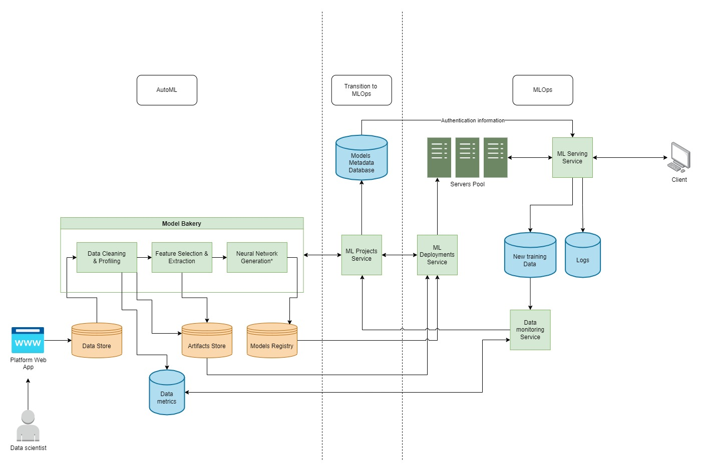

# Lighthouse-AI

<p align="center">
  
</p>

<p align="center">
    An end-to-end platform for creating and shipping machine learning models to production.
</p>

---

## Table of Contents

- [About Lighthouse-AI](#about-lighthouse-ai)
- [Getting Started](#getting-started)
  - [Production Setup](#production-setup)
  - [Development Setup with Docker](#development-setup-with-docker)
  - [Development Setup without Docker](#development-setup-without-docker)
- [Running](#running)
- [Screenshots](#screenshots)
- [Demo Video](#demo-video)
- [System Architecture](#system-architecture)
- [Project Structure](#project-structure)
- [Built with](#built-with)
- [Contributors](#contributors)
- [License](#license)

## About Lighthouse-AI

The Lighthouse-AI project is an end-to-end ML pipeline that...

**TODO**

## Getting Started

Lighthouse-AI needs the following services:

- Postgres.
- Redis.
- MongoDB.
- Azure Storage Account.
- Kubernetes cluster.

Lighthouse-AI could be run in 3 different ways: Production, Development, and Development with Docker.

### Production Setup

External services needed:

- Postgres.
- MongoDB.
- Azure Storage Account.

After that you can just apply the Kubernetes manifest found in `deploy/k8s` to your cluster.

### Development Setup with Docker

The only external services needed is an Azure Storage Account.
You will also need to have a running Kubernetes cluster. Please check [minikube](https://minikube.sigs.k8s.io/docs/start/) for more information on how to setup a local Kubernetes cluster.

Run the following command to setup the environment:

```bash
cd deploy
docker-compose up -d --build
```

Notes:

- You can change the environment variables in the `deploy/.env` file.
- You can comment unwanted services in the `deploy/docker-compose.yml` file.

### Development Setup without Docker

External services needed:

- Postgres.
- MongoDB.
- Redis.
- Azure Storage Account.

After that you can go to the following directories and follow the instructions for each service: `server`, `model_fit_creator`, `client`.

## Screenshots

**TODO**

## Demo Video

**TODO**

## System architecture



## Project structure

```
├── .github         <- GitHub templates and CI files.
│
├── client          <- Client code.
│
├── datasets        <- Datasets used for testing.
│
├── deploy
│   ├── k8s                 <- k8s manifests for deployment.
│   └── docker-compose.yml  <- Docker compose file for development.
│
├── docs                <- Documentation and examples.
│
├── infrastructure      <- Infrastructure code.
│
├── network_generator   <- Network generator module.
│
├── notebooks           <- Development code.
│
├── server              <- Server code.
│   │
│   └── lighthouse
│       │
│       ├── automl
│       │
│       ├── ml_projects
│       │   ├── api             <- ML projects API.
│       │   ├── db              <- ML projects database and migration scripts.
│       │   └── services        <- Contains the logic for orchestrating ML projects.
│       │
│       ├── mlops
│       │   ├── monitoring      <- Models monitoring service.
│       │   └── serving         <- Models deployment service.
│       │
│       ├── __main__.py         <- The entrypoint for the server.
│       ├── config.py           <- Contains the configuration for the server.
│       └── logger.py           <- Logging utility.
│
└── wrapper         <- ML model wrapper code.

```

## Built with

**TODO**

## License

**TODO**
